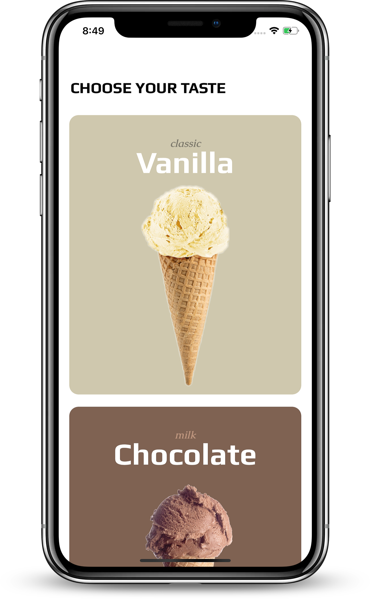
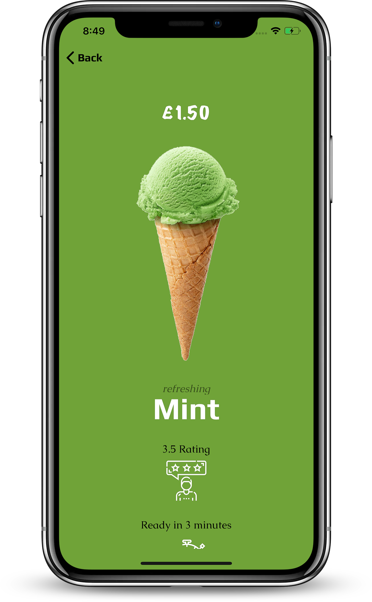
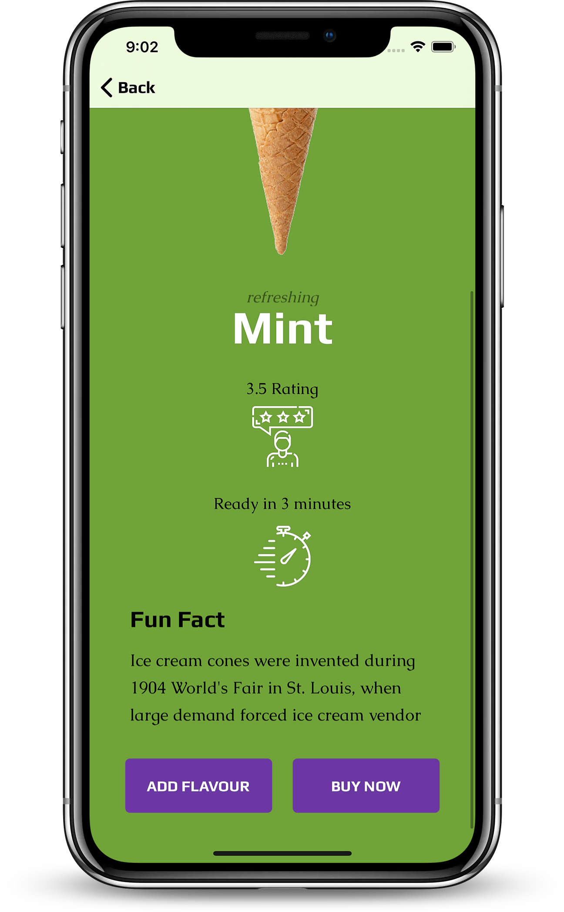
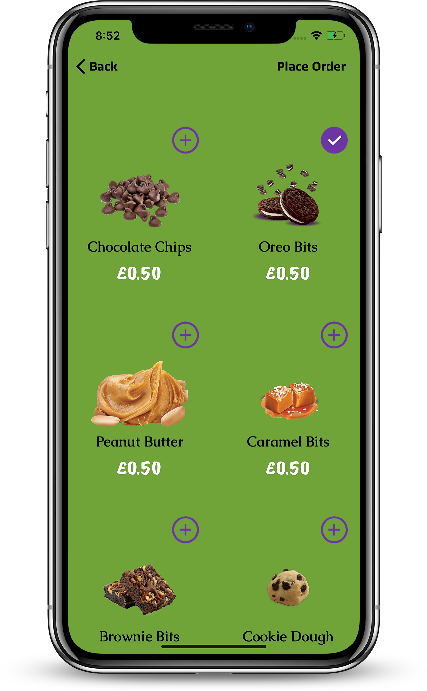
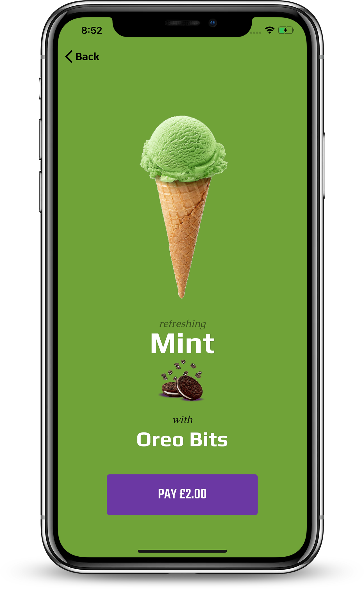
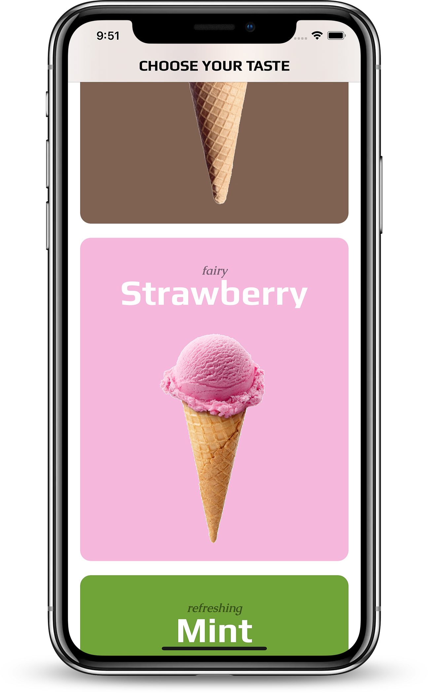
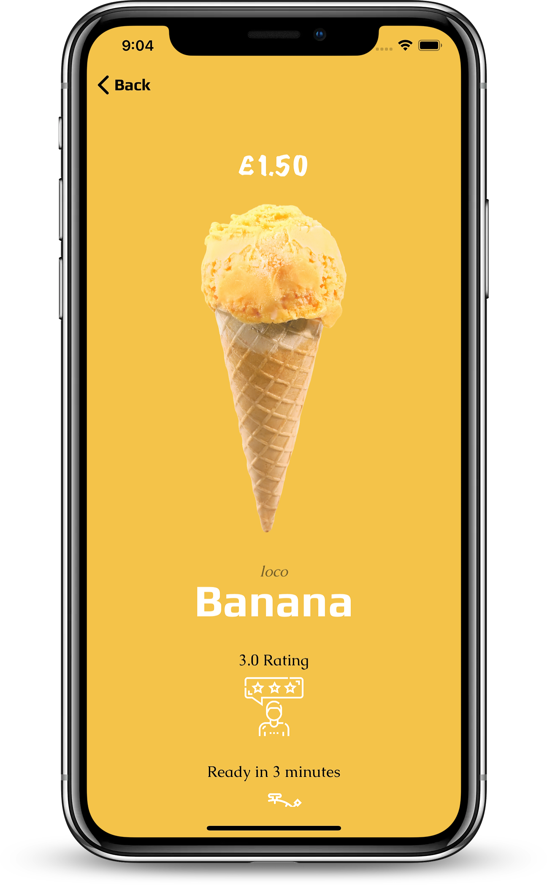
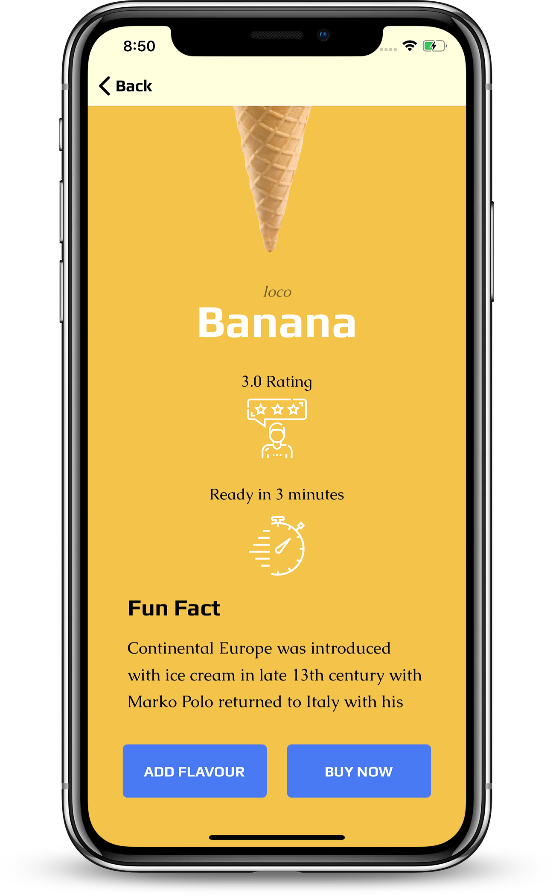
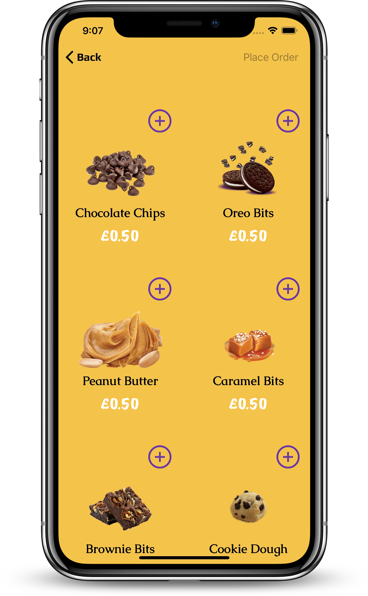
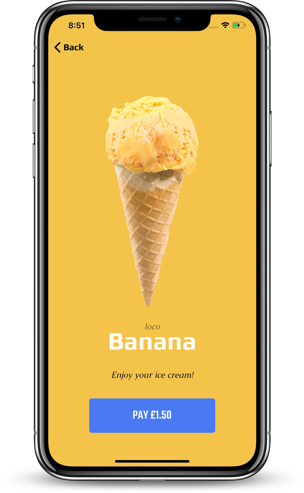

# Creams

Showcasing a simple mobile ordering experience for small food businesses, using a small ice cream shop as an example.

### Technologies Used:

* UIKit

### Features:

* Custom user interface for each flavour with background and button colours changing respectively.
* Choice to add a topping or not.

### Acknowledgements:

This is a very simple app that was inspired by one of the first Sprint challenges I had in Lambda School. It was a [playground project](https://github.com/tobikuyo/ios-sprint-challenge-ice-cream-shop), so I wanted to recreate it with a simple UI.

### Screenshots:
 

  
 
 
 
 
